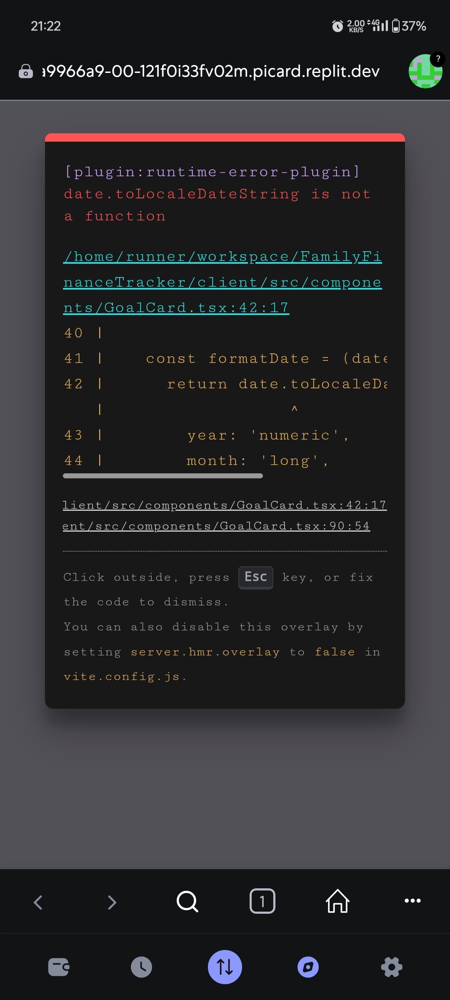
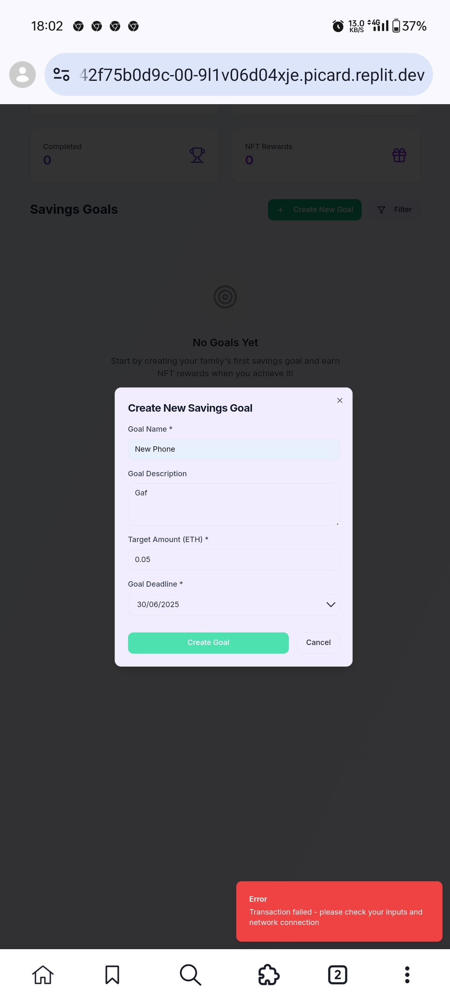
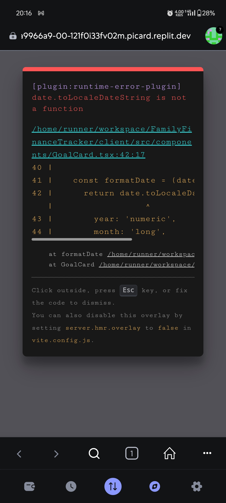

# Family Smart Saver - Complete Blockchain Savings Platform

A complete blockchain-based family savings platform built on Web5Layer network, featuring a React application and professional marketing website.

## 🌟 Project Overview

Family Smart Saver is a decentralized application (DApp) that enables families to create shared savings goals, contribute funds using WEB5 tokens, and track progress in real-time. The project includes both the main application and a professional marketing website.

## 📁 Repository Structure

```
family-smart-saver/
├── FamilyFinanceTracker/     # Main React Application
│   ├── client/               # Frontend React app
│   ├── server/               # Backend Express server
│   ├── shared/               # Shared types and schemas
│   ├── FamilySmartSaver.sol  # Smart contract
│   └── ...
├── website/                  # Marketing Website
│   ├── index.html           # Landing page
│   ├── styles.css           # Styling
│   ├── script.js            # Interactive features
│   └── README.md            # Website documentation
└── attached_assets/         # Screenshots and assets
```

## 🚀 Live Demo

- **Main App**: [Your Replit App URL]
- **Marketing Website**: [Your Replit Website URL]

## ⚡ Quick Start

### Prerequisites
- Node.js (v18+)
- MetaMask browser extension
- WEB5 tokens for Web5Layer network

### 1. Clone Repository
```bash
git clone https://github.com/Cannopy213/family-smart-saver.git
cd family-smart-saver
```

### 2. Install Dependencies
```bash
cd FamilyFinanceTracker
npm install
```

### 3. Start Development
```bash
npm run dev
```

### 4. Access Application
- Main App: `http://localhost:5000`
- Marketing Site: `cd ../website && python3 -m http.server 8080`

## 🏗️ Architecture

### Main Application (`FamilyFinanceTracker/`)
- **Frontend**: React + TypeScript + Tailwind CSS
- **Backend**: Express.js with TypeScript
- **Blockchain**: Web5Layer network integration
- **Smart Contract**: Deployed at `0x97C2A6E859F047FA36d7bA372e226917508c23b0`

### Marketing Website (`website/`)
- **Static Site**: HTML5 + CSS3 + Vanilla JavaScript
- **Responsive Design**: Mobile-first approach
- **Performance**: Optimized for fast loading

## 🔗 Blockchain Integration

### Web5Layer Network Configuration
```javascript
Network Name: Web5Layer
RPC URL: https://rpc.web5layer.xyz
Chain ID: 9000
Currency: WEB5
Contract Address: 0x97C2A6E859F047FA36d7bA372e226917508c23b0
```

### Smart Contract Features
- ✅ Create savings goals
- ✅ Family member contributions
- ✅ Progress tracking
- ✅ Automatic achievement detection
- ✅ Secure fund withdrawal

## 🎯 Key Features

### Application Features
- 🎯 **Goal Management**: Create and track family savings goals
- 💰 **Crypto Contributions**: Use WEB5 tokens for contributions
- 📊 **Real-time Dashboard**: Live progress tracking
- 🏆 **Achievement System**: Rewards when goals are completed
- 🌐 **Arabic RTL Support**: Multi-language interface
- 🔐 **Secure Wallet Integration**: MetaMask compatibility

### Website Features
- 📱 **Responsive Design**: Works on all devices
- 🎨 **Modern UI**: Clean, professional appearance
- ⚡ **Fast Loading**: Optimized performance
- 🔗 **Download Links**: Direct access to application
- 📋 **Technical Specs**: Complete blockchain information

## 🛠️ Development

### Available Scripts
```bash
npm run dev        # Start development server
npm run build      # Build for production
npm run start      # Start production server
```

### Project Structure
```
FamilyFinanceTracker/
├── client/
│   ├── src/
│   │   ├── components/    # Reusable UI components
│   │   ├── hooks/         # Custom React hooks
│   │   ├── lib/           # Utility libraries
│   │   ├── pages/         # Application pages
│   │   └── ...
├── server/                # Backend Express server
├── shared/                # Shared types and schemas
└── FamilySmartSaver.sol   # Smart contract source
```

## 🌐 Web5Layer Integration

### Network Setup
1. Add Web5Layer to MetaMask
2. Get WEB5 tokens from faucet
3. Connect wallet to application
4. Start creating savings goals

### Contract Interaction
The application interacts with the deployed smart contract to:
- Create new savings goals
- Process contributions from family members
- Track progress and achievements
- Handle secure withdrawals

## 📱 Screenshots

| Dashboard | Goal Creation | Progress Tracking |
|-----------|---------------|-------------------|
|  |  |  |

## 🚀 Deployment

### Replit Deployment
1. Fork this repository
2. Import to Replit
3. Configure environment variables
4. Deploy using Replit's hosting

### Independent Hosting
1. Build the application: `npm run build`
2. Deploy to any hosting platform
3. Configure Web5Layer network settings
4. Update contract address if needed

## 🔧 Configuration

### Environment Variables
```env
NODE_ENV=production
PORT=5000
CONTRACT_ADDRESS=0x97C2A6E859F047FA36d7bA372e226917508c23b0
```

### Network Configuration
Update `client/src/lib/constants.ts` with your contract address:
```typescript
export const DEFAULT_CONTRACT_ADDRESS = "0x97C2A6E859F047FA36d7bA372e226917508c23b0";
```

## 📖 Documentation

- [Contract Deployment Guide](FamilyFinanceTracker/CONTRACT_DEPLOYMENT.md)
- [Complete Setup Instructions](FamilyFinanceTracker/SETUP_INSTRUCTIONS.md)
- [Website Documentation](website/README.md)
- [External Setup Guide](FamilyFinanceTracker/EXTERNAL_SETUP.md)

## 🤝 Contributing

1. Fork the repository
2. Create a feature branch: `git checkout -b feature/new-feature`
3. Commit changes: `git commit -am 'Add new feature'`
4. Push to branch: `git push origin feature/new-feature`
5. Submit a Pull Request

## 📄 License

This project is licensed under the MIT License - see the [LICENSE](LICENSE) file for details.

## 🆘 Support

- **Issues**: [GitHub Issues](https://github.com/Cannopy213/family-smart-saver/issues)
- **Documentation**: Check the `/docs` folder
- **Community**: Join our discussions

## 🏷️ Tags

`blockchain` `web5layer` `savings` `family` `dapp` `react` `typescript` `smart-contracts` `cryptocurrency` `fintech`

---

**Built with ❤️ using Web5Layer blockchain technology**

© 2024 Family Smart Saver - Empowering families through blockchain savings
